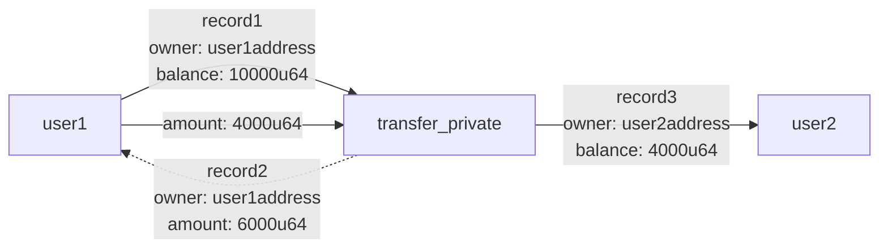
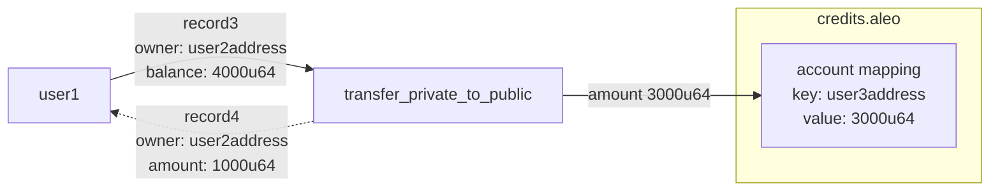
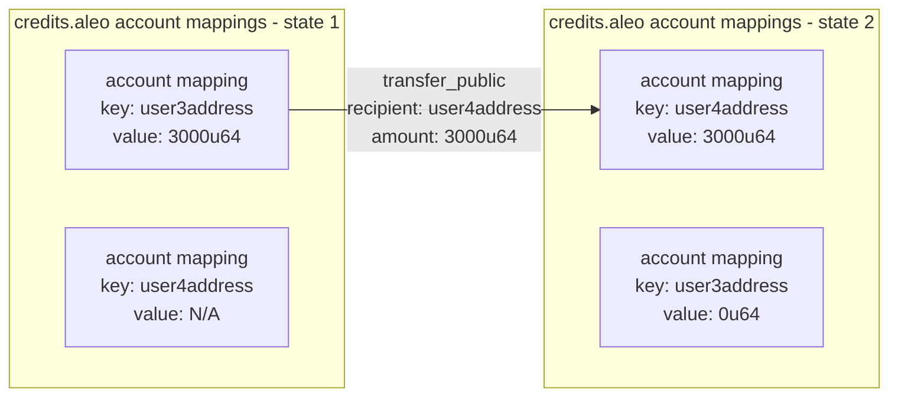
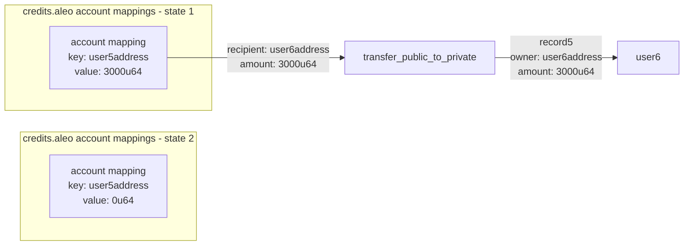
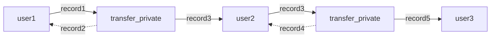

# B2

In [previous workshop](../B1), we built our first dApp on Aleo! In this section, we will learn how to handle the transactions with Aleo Credits, how to decrypt records to enable private transactions, wallet adapters in Aleo Ecosystem and creating transactions.


${\textsf{\color{blue}Aleo Credits}}$ are used to access blockspace and computational resources on the network, with users paying Credits to submit transactions and have them processed.


Aleo credits are defined in the `credits.aleo` program. This program is deployed to the Aleo network and defines data structures representing Aleo credits and the functions used to manage them.


There are two ways to hold Aleo credits


- Private balances via credits.aleo records
 - Public balances via credits.aleo account mappings

${\textsf{\color{green}Users can hold both private and public balances simultaneously.}}$

The ProgramManager allows transfers of Aleo credits via the transfer method. This function executes the credits.aleo program under the hood.


There are four transfer functions available:

**1. transfer_private**

**2. transfer_private_to_public**

**3. transfer_public**

**4. transfer_public_to_private**


All four of these functions can be used to transfer credits between users via the transfer function in the ProgramManager by specifying the transfer type as the third argument.

Lets check how these functions are handled in Aleo SDK.

First, we should define our ${\textsf{\color{green}networkClient}}$, ${\textsf{\color{green}keyProvider}}$, ${\textsf{\color{green}NetworkRecordProvider}}$ and ${\textsf{\color{green}programManager}}$.

```javascript
import { Account, ProgramManager, AleoKeyProvider, NetworkRecordProvider, AleoNetworkClient } from '@provablehq/sdk';

// Create a new NetworkClient, KeyProvider, and RecordProvider
const account = Account.from_string({privateKey: "user1PrivateKey"});
const networkClient = new AleoNetworkClient("https://api.explorer.aleo.org/v1");
const keyProvider = new AleoKeyProvider();
const recordProvider = new NetworkRecordProvider(account, networkClient);

// Initialize a program manager with the key provider to automatically fetch keys for executions
const USER_1_ADDRESS = "user1Address";
const programManager = new ProgramManager("https://api.explorer.aleo.org/v1", keyProvider, recordProvider);
programManager.setAccount(account);
```

Then, we can call the transfer functions.

**transfer_private**

```javascript
// Send a private transfer to yourself
const tx_id = await programManager.transfer(1, USER_1_ADDRESS, "transfer_private", 0.2);
```
*The diagram of a transfer_private function can be seen below*



⚠️ This function is 100% private and does not affect the account mapping.

**transfer_private_to_public**
```javascript
// Update or initialize a public balance in your own account mapping
const tx_id_2 = await programManager.transfer(1, USER_1_ADDRESS, "transfer_private_to_public", 0.2);
```
*The diagram representation of transfer_private_to_public can be seen below*



⚠️ This function consumes a record as a private input and generates a public balance in the account mapping entry belonging to the receiver.

**transfer_public**

Suppose you have 0.2 AC (Aleo Credits) at the beginning:

```javascript
// Check the value of your public balance
let public_balance = programManager.networkClient.getMappingValue("credits.aleo", USER_1_ADDRESS);
assert(public_balance === 0.2*1_000_000);

/// Send public transfer to another user
const USER_2_ADDRESS = "user2Address";
const tx_id_3 = await programManager.transfer(1, USER_2_ADDRESS, "transfer_public", 0.1);
```
After sending 0.1 AC to User 2, you can check whether the operation is successful or not by following code block
```javascript
// Check the value of the public balance and assert that it has been updated
public_balance = programManager.networkClient.getMappingValue("credits.aleo", USER_1_ADDRESS);
const user2_public_balance = programManager.networkClient.getMappingValue("credits.aleo", USER_1_ADDRESS);
assert(public_balance === 0.1*1_000_000);
assert(user2_public_balance === 0.1*1_000_000);
```
*The diagram representation of transfer_public can be seen below*


⚠️ This function is 100% public and does not consume or generate any records.

**transfer_public_to_private**
```javascript
/// Create a private record from a public balance
const tx_id_4 = await programManager.transfer(1, USER_1_ADDRESS, "transfer_public_to_private", 0.1);

// Check the value of the public balance
public_balance = programManager.networkClient.getMappingValue("credits.aleo", USER_1_ADDRESS);
```

*The diagram representation of transfer_public_to_private can be seen below*



⚠️ This function publicly consumes a balance in the account mapping entry belonging to the sender and generates a private record as a private output.

#

There are two types of data in Aleo: ${\textsf{\color{green}Private}}$ and ${\textsf{\color{green}Public}}$. Below, we will first analyze the Private data, and then explore how to handle Public data from SDK.


### Private state data: records

Records are analogous to the concept of [UTXOs](https://en.wikipedia.org/wiki/Unspent_transaction_output). When a record is created by a program, it can then be consumed later by the same program as an input to a function. Once a record is used as an input, it is considered consumed and cannot be used again. In many cases a new record will be created from the output of the function. 

`Records are private by default and are associated with a single Aleo program and a single private key representing a user.`

A straightforward example of a usage of records in a program can be demonstrated by explaining the process of private value transfers of Aleo credits on the Aleo network.

```leo
record credits:
    owner as address.private;
    microcredits as u64.private;
```

Credits records contain an owner field representing the address which owns the record and a microcredits field representing the amount of microcredits in the record. 
1 credit is equal to 1,000,000 microcredits.

Below is an example diagram chain of private state changes



In the above diagram, User 1 sends a private value transfer to User 2. Then, User 2 receives the transaction ID and fetches the credits record they received from User 1 from the network. They then send it to User 3

Let’s get over how this is being handled by Aleo SDK:

*User 1*
```javascript
import { Account, ProgramManager, AleoKeyProvider, NetworkRecordProvider, AleoNetworkClient } from '@provablehq/sdk';

// Create a new NetworkClient, KeyProvider, and RecordProvider
const account = Account.from_string({privateKey: "user1PrivateKey"});
const networkClient = new AleoNetworkClient("https://api.explorer.aleo.org/v1");
const keyProvider = new AleoKeyProvider();
const recordProvider = new NetworkRecordProvider(account, networkClient);

// Initialize a program manager with the key provider to automatically fetch keys for executions
const USER_2_ADDRESS = "user2Address";
const programManager = new ProgramManager("https://api.explorer.aleo.org/v1", keyProvider, recordProvider);
programManager.setAccount(account);

/// Send private transfer to User 2
const tx_id = await programManager.transfer(1, USER_2_ADDRESS, "transfer_private", 0.2);
 ```

*User 2*
```javascript
// USER 2
import { Account, ProgramManager, AleoKeyProvider, NetworkRecordProvider, AleoNetworkClient } from '@provablehq/sdk';

// Create a new NetworkClient, KeyProvider, and RecordProvider
const account = Account.from_string({privateKey: "user2PrivateKey"});
const networkClient = new AleoNetworkClient("https://api.explorer.aleo.org/v1");
const keyProvider = new AleoKeyProvider();
const recordProvider_User2 = new NetworkRecordProvider(account, networkClient);

// Initialize a program manager with the key provider to automatically fetch keys for executions
const programManager = new ProgramManager("https://api.explorer.aleo.org/v1", keyProvider, recordProvider);
programManager.setAccount(account);

// Fetch the transaction from the network that user 1 sent
const transaction = await programManager.networkClient.getTransaction(tx_id);
const record = <string>transaction.execution.transitions[0].outputs[0].value;

// Decrypt the record with the user's view key
const recordCiphertext = <RecordCiphertext>RecordCiphertext.fromString(record);
const recordPlaintext = <RecordPlaintext>recordCiphertext.decrypt(account.viewKey());

// Send a transfer to user 3 using the record found above
const USER_3_ADDRESS = "user3Address";
const tx_id = await programManager.transfer(1, USER_3_ADDRESS, "transfer_private", 0.2, undefined, recordPlaintext);
```

Because the records are encrypted when they're posted on the network, they do not reveal any information about the party who executed the program, nor the contents of the record. The only information that is ${\textsf{\color{green}revealed}}$ is the ${\textsf{\color{green}Program ID}}$, ${\textsf{\color{green}function name}}$, ${\textsf{\color{green}encrypted function inputs}}$, and the ${\textsf{\color{green}transaction ID}}$ of the program execution. 

No user except for the recipient of the record can see the contents of the record.
#
Until now, we figured out how the private value transfers are being handled and the effective usage of records in this terms. But, the records don’t have to belong to credits.aleo program. In fact, they can be anything such as voting right, auction offer etc. 

When handling these types of records, the dApp builders might have to `decrypt` the records. 

If a user receives a private record from a program execution, they can use the SDK to decrypt encrypted records with their view keys and view their contents. Only records that are owned by the user can be decrypted. ${\textsf{\color{red}Decryption of records that are not owned by the user will fail}}$.


Record decryption and ownership verification can be done in the SDK using the following code:

```javascript
import { Account, RecordCiphertext, RecordPlaintext } from '@provablehq/sdk';

// Create an account from an existing private key
const account = Account.from_string({privateKey: "existingPrivateKey"});

// Record value received as a string from program output or found on the Aleo network
const record = "record1qyqsq4r7mcd3ystjvjqda0v2a6dxnyzg9mk2daqjh0wwh359h396k7c9qyxx66trwfhkxun9v35hguerqqpqzqzshsw8dphxlzn5frh8pknsm5zlvhhee79xnhfesu68nkw75dt2qgrye03xqm4zf5xg5n6nscmmzh7ztgptlrzxq95syrzeaqaqu3vpzqf03s6";

const recordCiphertext = RecordCiphertext.fromString(record);

// Check ownership of the record. If the account is the owner, decrypt the record
if (RecordCiphertext.is_owner(account.viewKey())) {
   // Decrypt the record with the account's view key
   const recordPlaintext = recordCiphertext.decrypt(account.viewKey());

   // View the record data
   console.log(recordPlaintext.toString());
}
```

### Public State Data: Mappings

Mappings are simple key value stores defined in a program. They are represented by a key and a value each of a specified type. They are stored directly within the Aleo blockchain and can be publicly read by any participant in the Aleo network.

An example of a mapping usage is the account mapping in the credits.aleo program.
```leo
mapping account:
    key owner as address.public;
    value microcredits as u64.public;
```

The `account mapping` is used to ${\textsf{\color{green}store public credit balances}}$ on the Aleo network. It takes a public address as a key and a public u64 value representing the number of microcredits owned by the address.

Any state within a program mapping is public and can be read by any participant in the Aleo network. The `NetworkClient` class provides the `getMapping` method to read the public mappings within an program and the `getMappingValue` method to read the value of a specific key within a mapping.
```javascript
import { AleoNetworkClient } from '@provablehq/sdk';

const networkClient = new AleoNetworkClient("https://api.explorer.aleo.org/v1");
const creditsMappings = networkClient.getMappings("credits.aleo");
assert(creditsMappings === ["account"]);

const publicCredits = networkClient.getMapping("credits.aleo", "[a valid aleo account with zero balance]");
assert(publicCredits === "0u64");
```

Updating mappings is done by executing a program function on the Aleo network which has a async function block that updates the program's mapping. For instance, the `transfer_public` function in the `credits.aleo` program updates the account mapping (and thus a user's balance) when called.

A simple example of a mapping update can be shown by simply executing 'transfer_public` as shown below.

```javascript
import { Account, ProgramManager, AleoKeyProvider, NetworkRecordProvider, AleoNetworkClient } from '@provablehq/sdk';

// Create a new NetworkClient, KeyProvider, and RecordProvider
const account = Account.from_string({privateKey: "user1PrivateKey"});
const networkClient = new AleoNetworkClient("https://api.explorer.aleo.org/v1");
const keyProvider = new AleoKeyProvider();
const recordProvider = new NetworkRecordProvider(account, networkClient);

// Initialize a program manager with the key provider to automatically fetch keys for executions
const RECIPIENT_ADDRESS = "user1Address";
const programManager = new ProgramManager("https://api.explorer.aleo.org/v1", keyProvider, recordProvider);
programManager.setAccount(account);

// Update or initialize a public balance
const tx_id = await programManager.transfer(1, RECIPIENT_ADDRESS, "transfer_private_to_public", 0.2);
```

#

When building dApps, one of the crucial components is the ${\textsf{\color{green}wallet adapter}}$. These wallet adapters handle the state management of a connected wallet address in the dApp and simplify the process by providing an easier connection interface with custom components.

You can check the [Aleo Wallet Adapter](https://github.com/demox-labs/aleo-wallet-adapter) library, which is the hub for all Aleo Wallet adapters.

Additionally, you can check Arcane Finance’s [wallet adapters](https://github.com/arcane-finance-defi/aleo-wallet-adapters), where they have gathered different wallet adapters within the Aleo Ecosystem.

Below, we will demonstrate how to use them collectively to build a wallet adapter that works with different wallets:

First, download both repositories with `npm` based on their custom download commands. These are defined in their corresponding repositories.  

Next, we will import Demox Labs’ wallet adapter along with Arcane Finance’s different adapters:
```javascript
import React, { useMemo, useEffect } from "react";
import ReactDOM from "react-dom/client";
import { BrowserRouter as Router, Routes, Route } from 'react-router-dom';
import App from "./App";
import "./index.css";
import { WalletProvider } from "@demox-labs/aleo-wallet-adapter-react";
import { WalletModalProvider } from "@demox-labs/aleo-wallet-adapter-reactui";
import {
 PuzzleWalletAdapter,
 LeoWalletAdapter,
 FoxWalletAdapter,
 SoterWalletAdapter,
 AvailWalletAdapter,
 configureConnectionForPuzzle 
} from 'aleo-adapters';
import {
 WalletAdapterNetwork,
 DecryptPermission
} from "@demox-labs/aleo-wallet-adapter-base";
import "@demox-labs/aleo-wallet-adapter-reactui/styles.css";
```

Define the wallets that we want to use in our dApp:
```javascript
const wallets = useMemo(
   () => [
       new LeoWalletAdapter({
           appName: 'Aleo Crowdfunding',
       }),
       new PuzzleWalletAdapter({
           appName: 'Aleo Crowdfunding',
       }),
       new FoxWalletAdapter({
           appName: 'Aleo Crowdfunding',
       }),
       new SoterWalletAdapter({
           appName: 'Aleo Crowdfunding',
       }),
       new AvailWalletAdapter({
           appName: 'Aleo Crowdfunding',
       })
   ],
   [],
 );


 useEffect(() => {
   configureConnectionForPuzzle({
       dAppName: 'Aleo Crowdfunding',
       dAppDescription: 'Crowdfunding Example',
       dAppUrl: `http://localhost:5173/`,
       dAppIconURL: ``
   });
 }, []);
```

Next, wrap our app with the wallet adapters and provide it to the root:
```javascript
return (
   <WalletProvider
     network={WalletAdapterNetwork.TestnetBeta}
     decryptPermission={DecryptPermission.UponRequest}
     wallets={wallets}
     autoConnect
   >
     <WalletModalProvider>
       <Router>
         <Routes>
           <Route path="/" element={<App />} />
         </Routes>
       </Router>
     </WalletModalProvider>
   </WalletProvider>
 );

const rootElement = document.getElementById("root");


if (rootElement) {
 ReactDOM.createRoot(rootElement).render(
   <React.StrictMode>
     <MainApp />
   </React.StrictMode>,
 );
} else {
 throw new Error("Root element not found");
}
```

After combining everything, our code structure should look like this:
```javascript
import React, { useMemo, useEffect } from "react";
import ReactDOM from "react-dom/client";
import { BrowserRouter as Router, Routes, Route } from 'react-router-dom';
import App from "./App";
import "./index.css";
import { WalletProvider } from "@demox-labs/aleo-wallet-adapter-react";
import { WalletModalProvider } from "@demox-labs/aleo-wallet-adapter-reactui";
import {
 PuzzleWalletAdapter,
 LeoWalletAdapter,
 FoxWalletAdapter,
 SoterWalletAdapter,
 AvailWalletAdapter,
 configureConnectionForPuzzle 
} from 'aleo-adapters';
import {
 WalletAdapterNetwork,
 DecryptPermission
} from "@demox-labs/aleo-wallet-adapter-base";
import "@demox-labs/aleo-wallet-adapter-reactui/styles.css";


const MainApp = () => {
 const wallets = useMemo(
   () => [
       new LeoWalletAdapter({
           appName: 'Aleo Crowdfunding',
       }),
       new PuzzleWalletAdapter({
           appName: 'Aleo Crowdfunding',
       }),
       new FoxWalletAdapter({
           appName: 'Aleo Crowdfunding',
       }),
       new SoterWalletAdapter({
           appName: 'Aleo Crowdfunding',
       }),
       new AvailWalletAdapter({
           appName: 'Aleo Crowdfunding',
       })
   ],
   [],
 );


 useEffect(() => {
   configureConnectionForPuzzle({
       dAppName: 'Aleo Crowdfunding',
       dAppDescription: 'Crowdfunding Example',
       dAppUrl: `http://localhost:5173/`,
       dAppIconURL: ``
   });
 }, []);


 return (
   <WalletProvider
     network={WalletAdapterNetwork.TestnetBeta}
     decryptPermission={DecryptPermission.UponRequest}
     wallets={wallets}
     autoConnect
   >
     <WalletModalProvider>
       <Router>
         <Routes>
           <Route path="/" element={<App />} />
         </Routes>
       </Router>
     </WalletModalProvider>
   </WalletProvider>
 );
};


const rootElement = document.getElementById("root");


if (rootElement) {
 ReactDOM.createRoot(rootElement).render(
   <React.StrictMode>
     <MainApp />
   </React.StrictMode>,
 );
} else {
 throw new Error("Root element not found");
}
```

To import the ${\textsf{\color{blue}Connect Wallet}}$ button in any of your app pages, simply import the button and include it in your page:
```javascript
import '../styles/MenuBar.css';
import { WalletMultiButton } from '@demox-labs/aleo-wallet-adapter-reactui';


const MenuBar = () => {
 return (
   <header className="header">
     <h1>Aleo Crowdfunding</h1>
     <div className="header-buttons">
     <WalletMultiButton className="bg-[#154bf9]" />
     </div>
   </header>
 );
};


export default MenuBar;
```

For further details such as record decryption, preparing transactions, subscribing to events, and other functionalities of the Aleo Wallet Adapter, check the [README](https://github.com/demox-labs/aleo-wallet-adapter/blob/main/README.md) in the GitHub repository!

### Hands-On!

Previously, we built an example for our custom token’s `mint_public` and `mint_private` functions 🪙

Now, let’s build a program to transfer Aleo Credits!

*Bonus*

Add a part to decrypt records by Wallet Adapters. It will take the type `record` and return a plain text representation of it.

<details><summary> Hint</summary>
Remember that we have 4 transfer functions:
-	transfer_private
-	transfer_private_to_public
-	transfer_public
-	transfer_public_to_private

For Bonus, be careful for the statement “Records are private by default and are associated with a single Aleo program and a single private key representing a user.” 
</details>


If you have any questions, don't hesitate to visit [Aleo Discord](https://discord.gg/aleo).


The built example can be found [here](./state_management_example).

